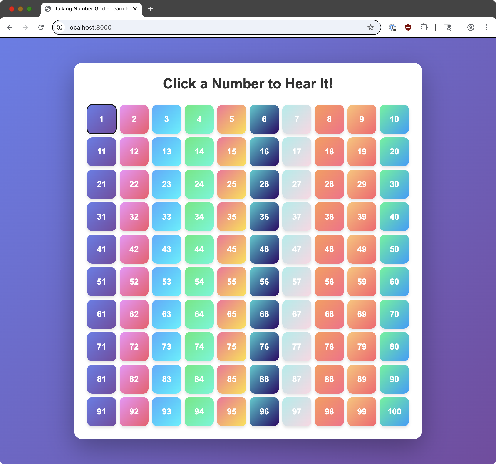

# Talking-Number Grid

Grid of numbers 1 to 100 that say the number when you click on it, for teaching kids.

**Play it here: https://justinpearson.github.io/talking-number-grid/**



## Run Locally

```bash
git clone https://github.com/justinpearson/talking-number-grid.git
cd talking-number-grid
python3 -m http.server
```

Then open http://localhost:8000/

## Created by [Claude Code](https://claude.ai/code)

> "I want to make a simple website that shows a grid of numbers from 1 to 100, and when you click on a number, it speaks the name of the number. Here's an empty repo to work in. The README.md has a link to a pic of how I'd like the buttons styled. Use speech synthesis API. Then configure the repo to publish to Github Pages."
